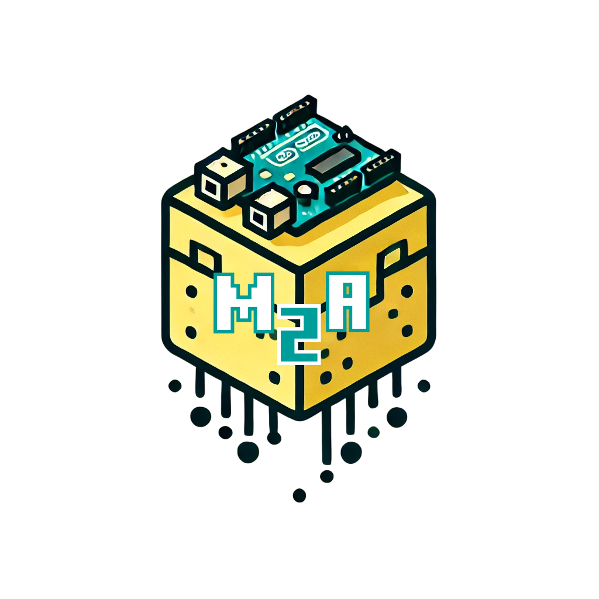
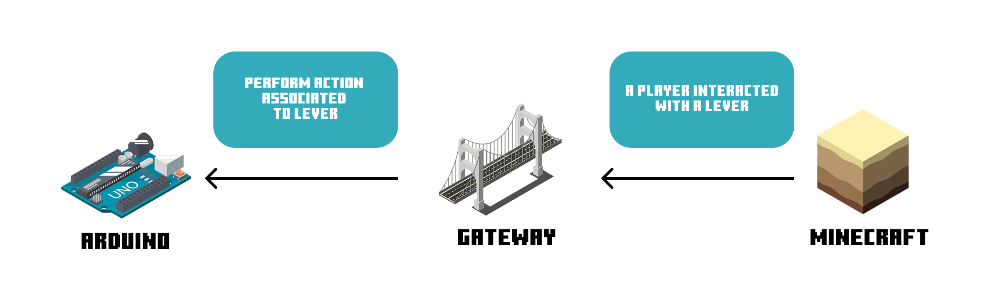
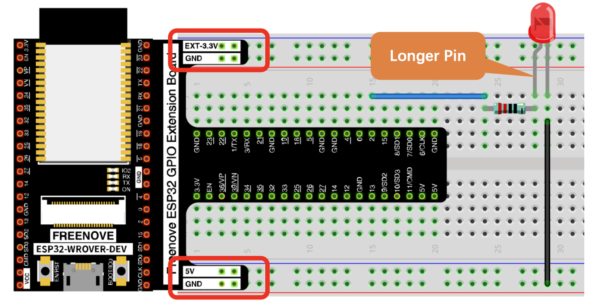

<p align="center">
  
</p>

# Description

Minecraft2Arduino is a project that enables interactions between Minecraft and Arduino, allowing actions in the real world based on in-game events. Think of it as a direct portal between Minecraft and reality!


# Summary

- Global Architecture
- Arduino Side
- Gateway Side
- Minecraft Side
- Documentation
- Setup Example 🚀
  
# Global Architecture
The system consists of three main components: <br>
  1. Arduino: Connects to the gateway via WebSockets and executes received commands. <br>
  2. Gateway: Acts as a WebSocket server relaying messages between Arduino and Minecraft. <br>
  3. Minecraft Plugin: Captures in-game interactions and forwards them to the gateway. <br>

<p align="center">
  
</p>

# Arduino Side
📂 Code Location: [Microcontroller](./Microcontroller)
<br><br>
The Arduino connects to the gateway using WebSockets and processes incoming messages to perform actions in the real world.

Libraries Used:
- ```WiFi.h``` (for network connectivity)
- ```ArduinoWebsockets.h``` (to communicate via WebSockets)
- ```string.h``` (for handling strings)

# Gateway Side
📂 Code Location: [WebSocketGateway](./WebSocketGateway)
<br><br>
The gateway is a WebSocket server that facilitates communication between Arduino and Minecraft.

Technology Stack:
- ```Node.js``` (for WebSocket server implementation)
- ```ws package``` (for WebSocket handling)

# Minecraft Side
📂 Code Location: [Plugin](./Plugin)
<br><br>
A Minecraft plugin that captures player interactions and transmits relevant data to the gateway.

Libraries Used:
- ```Spigot-API``` (to interact with Minecraft server events)
- ```Socket``` (to communicate with the gateway)

# Documentation

## Minecraft plugin 
### Available Commands

```/m2a``` Gives you the registeration item.

```/m2a debug``` Toggles debug mode.

```/m2a gui``` Opens the block management GUI.

```/m2a list``` Displays all registered blocks.

```/m2a remove <name>``` Removes a block by its name.

```/m2a rename <old_name> <new_name>``` Renames a block.

### Config files

```save.yml``` list of registred blocks

```socket.yml``` socket connexion informations (ip and port)

## Gateway

Default port : ```8080```

## Microcontroller

Default port : ```8080```

# Setup Example 🚀

For my example I use an esp32 for the microcontroller, and I host the minecraft server and the gateway on a VPS. 

You can found all the files here:

- [MinecraftServer](./MinecraftServer)
- [Gateway Server File](./WebSocketGateway/websocket-server.js)
- [ESP32 Code](./Microcontroller/esp32_test.ino)

## Step 1 : Setup the Gateway

You need to install


- ```node```
- ```npm```


Move the websocket-server.js file to the directory you want (on my VPS for me)


start with ```node websocket-server.js```

## Step 2 : Setup Minecraft Server

You need to install


- ```java```

Move the MinecraftServer file where you want (also on my VPS for me)

- start it with ```sh start.sh```

- connect to it

- execute ```m2a``` to get registration item

- right click on the block you want (lever for me)

- in my example I rename it 'led' with ```/m2a rename lever led```

- edit ```socket.yml``` to put the ip and port (I use my VPS ip and the 8080 port)

- save the file

- restart the server

## Step 3 : Setup ESP32

You need:
- esp32
- ArduinoIDE

wire your esp32 like that:
<p align="center">
  
</p>

- open ```test_esp32.ino``` file

- install libraries

- change wifi informations

- upload the ```test_esp32.ino``` programm to your esp32


